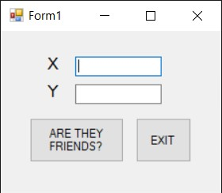
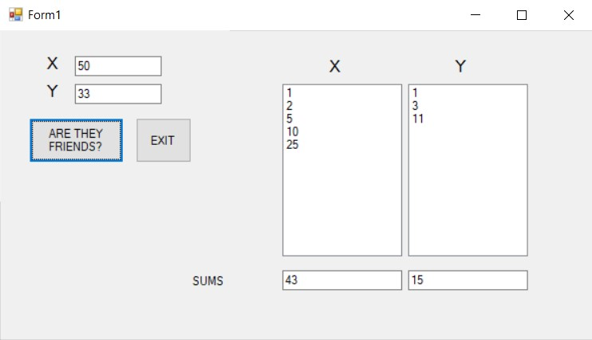
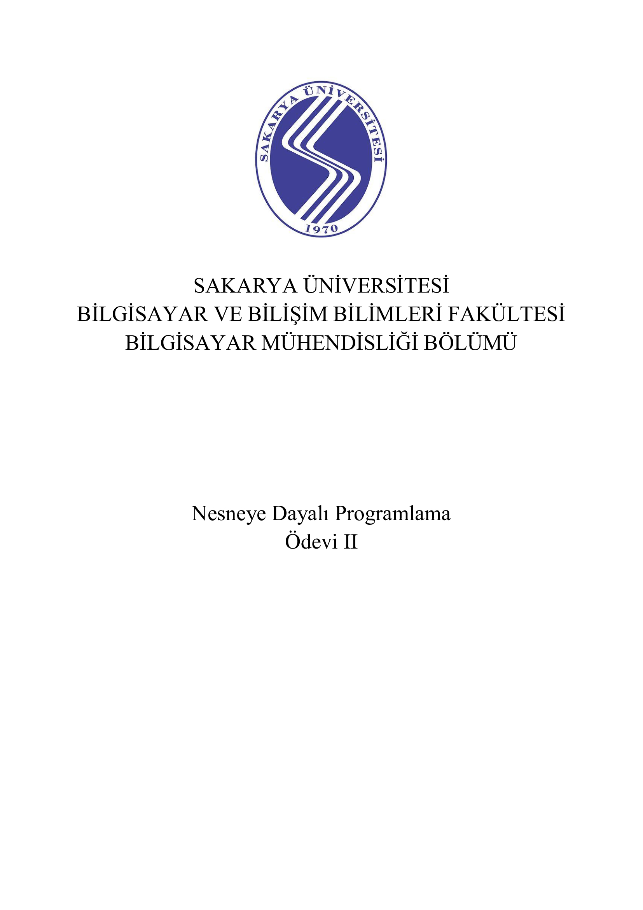
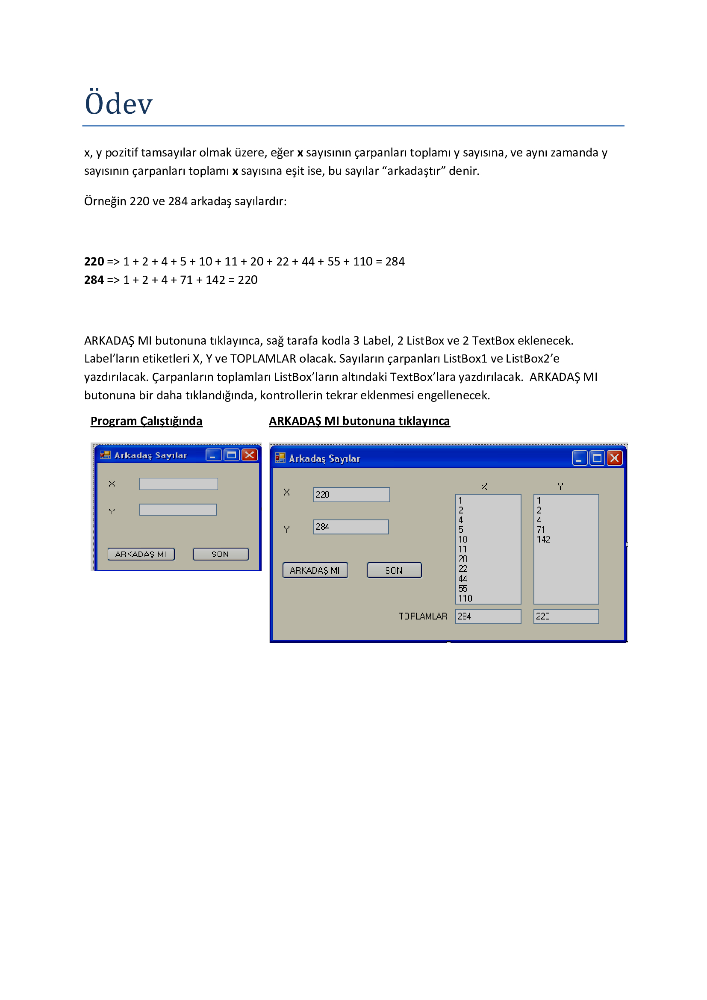
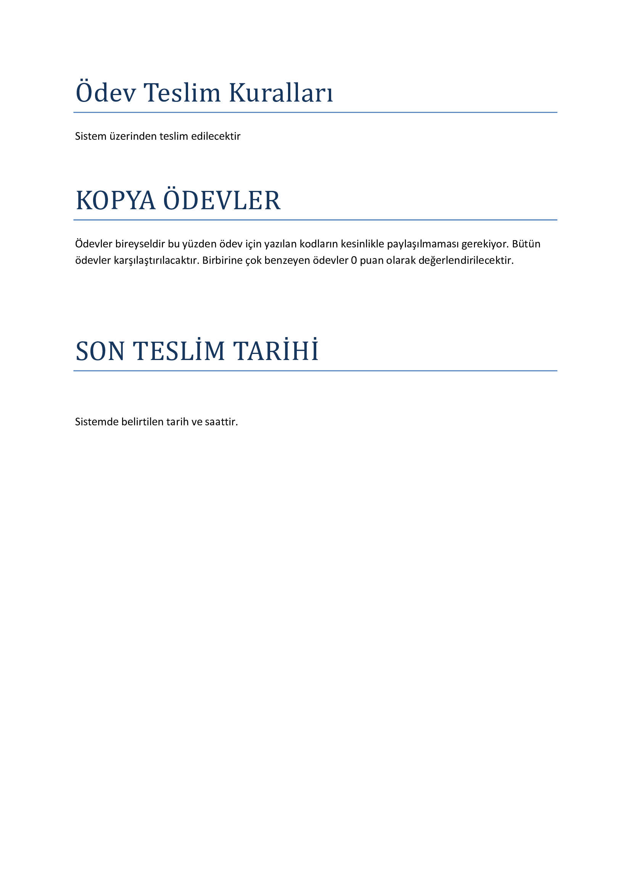
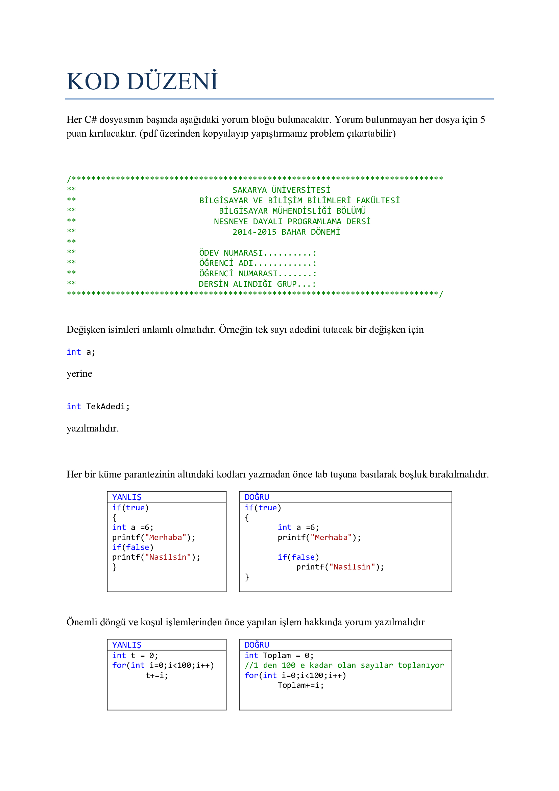

# 2019
# Friendly Numbers - Object Oriented Programming Project

  At assignment, to make the application that finds find out if the 2 numbers entered are friendly numbers.
  
  Friendly numbers are if the sums of the divisions of 2 numbers into smaller numbers are equal.

### Used Technologies
  
  - C#
   
## Screenshots

## Homework Document

Sakarya University - Computer Engineering - Object Oriented Programming Course Homework

  - Berkay Şahin - https://github.com/berkaysahin - https://www.linkedin.com/in/berkaysahin3/ - iletisim@berkaysahin.info

